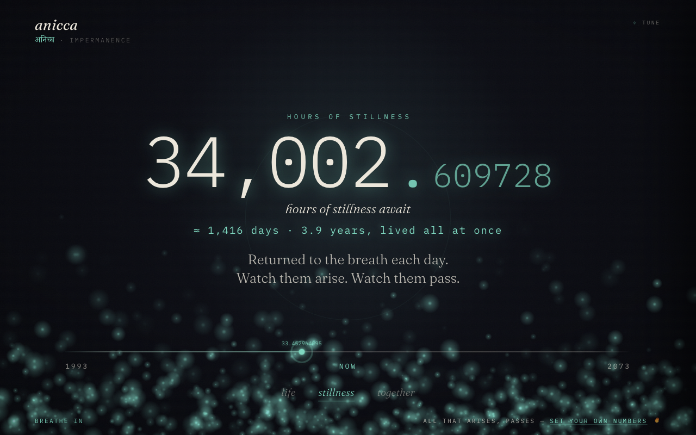

# anicca

> **अनिच्च** · *anicca* — Pali for **impermanence**. All that arises, passes.



A live meditation on finite time. Not a death-countdown — a quiet reminder of the
waking, meaningful hours you *still have*, rendered as light against the dark.

The same engine, three **lenses**:

- **life** — the waking hours left in your own life
- **stillness** — the hours of meditation still ahead, if you sit each day
- **together** — the waking hours you have left to actually spend with someone you love

The number streams in real time; the present moment dissolves in the decimals.
Behind it, a field of motes **arises and passes** — the flux you watch on the cushion.
On the *stillness* lens, the whole page breathes.

## Use it

Open `index.html`. That's it — it's a single static page, no build step, no
dependencies. Switch lenses with the words at the bottom (or keys `1` / `2` / `3`).

Or live it in every new tab — **anicca** is on the Firefox Add-ons store:

<a href="https://addons.mozilla.org/en-US/firefox/addon/anicca-new-tab/"></a>

### Make it yours

Hit **tune** (top-right) and edit the numbers — they recompute live, persist in
your browser, and write themselves into the URL so any configuration is shareable.

You can also set everything by query string:

```
index.html?youDob=1992-06-15&theirDob=1990-06-15&theirName=<name>&sleep=8&work=8&personal=2&meditation=2&togetherToAge=60&toAge=80
```

| param           | meaning                                   | default |
| --------------- | ----------------------------------------- | ------- |
| `youDob`        | your date of birth (`YYYY-MM-DD`)         | 1992-01-01 |
| `theirDob`      | their date of birth (`YYYY-MM-DD`)        | 1990-01-01 |
| `theirName`     | their name (shown on the *together* lens) | `<name>` |
| `sleep`         | hours of sleep per day                    | 8       |
| `work`          | hours of work per day                     | 8       |
| `personal`      | hours of upkeep per day (shower, etc.)    | 2       |
| `meditation`    | hours of stillness per day                | 2       |
| `togetherToAge` | age you both at least reach (binds on the elder) | 60 |
| `toAge`         | a realistic life horizon                  | 80      |
| `lens`          | which lens to open on — `life` · `stillness` · `together` | together |

Every lens is directly linkable — switch lenses and the URL updates live, so you
can send someone straight to, say, `…/anicca?lens=stillness`.

> **The math.** Waking hours = `(24 − sleep)` per day. Together hours =
> `(24 − sleep − work − personal)` per day. Each lens multiplies its daily hours by
> the days left until its horizon. The *together* horizon binds on whoever reaches
> `togetherToAge` first.

## Deploy to GitHub Pages

```
git init && git add . && git commit -m "anicca"
git branch -M main
git remote add origin git@github.com:NISH1001/anicca.git
git push -u origin main
```

Then **Settings → Pages → Source: `main` / root**. Live at
`https://nish1001.github.io/anicca`.

## Privacy note

The shared engine ships **neutral** defaults — no personal data. This page seeds
its own real values via a small `window.ANICCA_DEFAULTS` script in `index.html`
(your call what goes there). The Firefox add-on stays neutral and asks each person
for their own details on first run, so it carries nothing personal.

---

*Built with intention, not slop. Fraunces + IBM Plex Mono, vanilla JS, a canvas, and the dark.*
